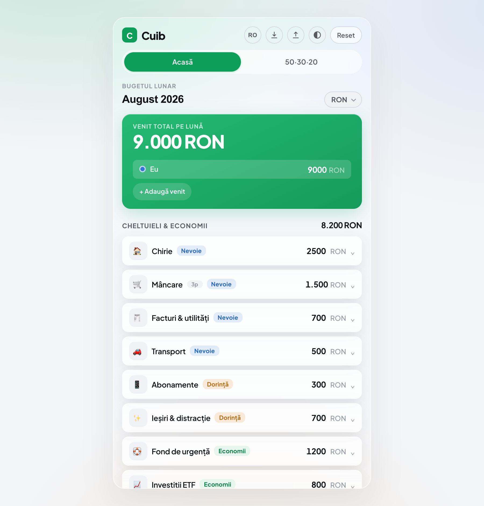
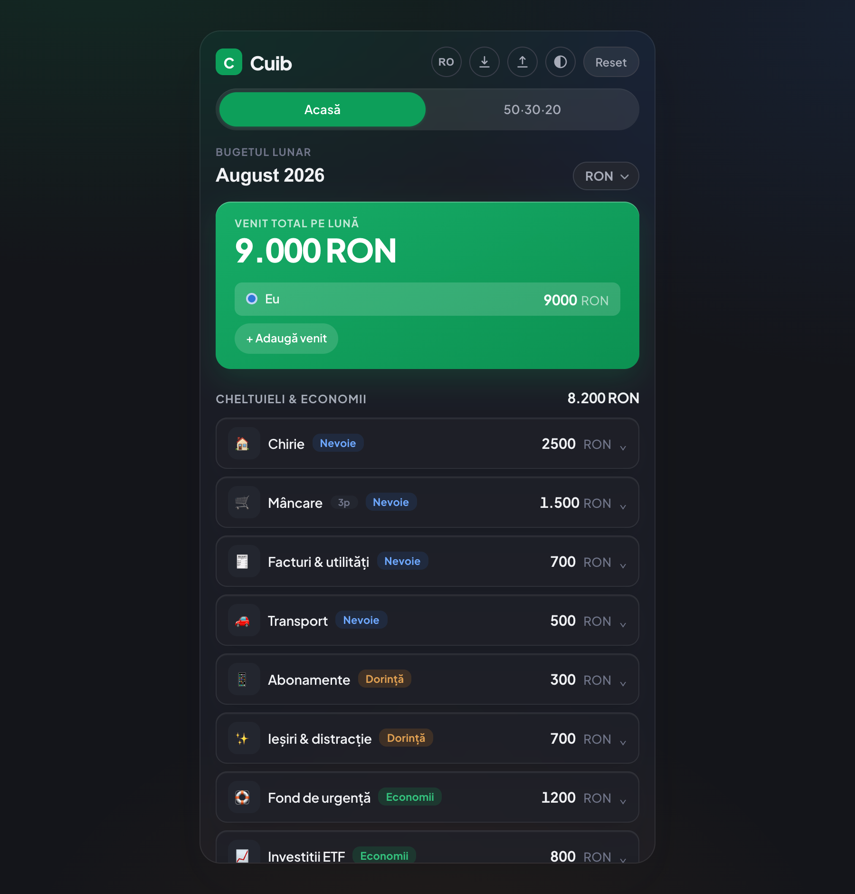
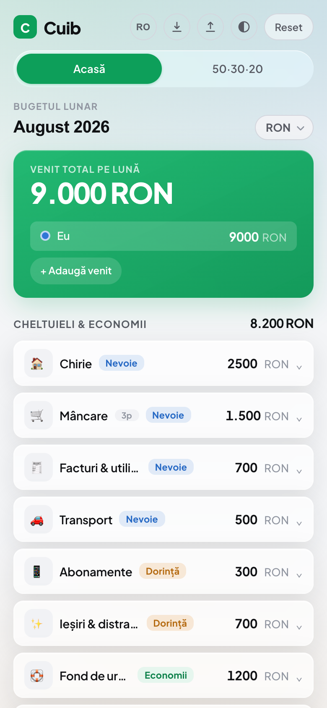

# Cuib

A monthly budget that lives entirely in your browser. Add your income and expenses, and Cuib shows you, in real time, **who pays what**, whether the month adds up, and **how healthy your budget is** against the 50-30-20 rule.

No framework. No server. No account. No tracking. Just a static page, and your data stays on your device.

Live demo: [cuibbudget.andyeas.com](https://cuibbudget.andyeas.com)

The interface comes in **Romanian and English** (switch from the header). It works on a phone too: a single-column layout, expense rows collapse to one line, and every action fits the small screen.



## Why

I built this because I needed something to organize my budget: to get my money in order, actually save, and see clearly what I spend on. I could not find a tool that just did that, simply, without an account or my data sitting on someone else's server.

So Cuib is the opposite of most budgeting apps: a single static page where everything is calculated locally and nothing ever leaves the browser. It also does the one thing I kept wanting: split shared costs fairly between people and tell me, honestly, whether the month works.

## Features

### Budget

- **Multiple incomes** - one or more people, each with a name and a color.
- **Three categories** - Needs, Wants and Savings, the basis of the 50-30-20 model.
- **Sub-expenses** - break any expense into parts; its amount becomes the sum of the parts automatically, and the first part keeps the original amount so no money is lost.
- **Custom icon** - an emoji or short text (up to 4 characters) per expense, auto-sized to fit.
- **Deficit warning** - if someone is assigned more than they earn, they are flagged in red.

### Splitting (2+ people)

- **Proportional split** - shared expenses are divided in proportion to each person's income.
- **Personal expenses** - anything tagged to a person is paid in full by that person.
- **Ownership per part, or derived** - ownership is set on each part; an expense with parts shows a colored dot only when every part belongs to the same person, otherwise it reads as shared.
- **Exact to the last coin** - the split uses the largest-remainder method, so what people pay adds up exactly to the total, with nothing lost to rounding.

### The 50-30-20 screen

- **Live donut** of your real split (needs / wants / savings / unallocated), with your savings rate in the center.
- **Feedback in money, not just percentages** - "over the cap by 700", "under, you can still allocate 900", "you are 400 short of 20%".
- **At-a-glance verdict** - "2 of 3 on target".

### Save and share

- **PDF report** - a clean one-page summary of the month (income, who pays what, expenses grouped by category with their parts, and the 50-30-20 rule with plain-language verdicts), ready to save as PDF and pass to anyone.
- **.json file** - export all your data to move it to another device or keep a backup copy, and load it back.

### Quality of life

- **Math in amount fields** - type `50+30+12` and it becomes 92; `3*15` respects precedence. A small, safe evaluator, no `eval`.
- **Whole numbers** - amounts are rounded on entry, so there are never fractional-coin values.
- **Reorder and duplicate** expenses from a per-row action menu.
- **In-app dialogs** - every confirmation is a themed popup, not a browser dialog; close with Esc or a click outside.
- **Fast serial entry** - after adding an expense the name field refocuses, so you can add many in a row.

### Appearance and data

- **Light / dark theme**, remembered across visits.
- **Two languages** - Romanian and English, including the report; the demo data follows the language too.
- **Currency selector** - RON, EUR, USD, GBP, CHF, applied everywhere instantly.
- **Autosave** in localStorage, surviving a closed tab.
- **Self-repairing** - corrupt or outdated saved data is validated and fixed on load, or falls back to the demo data.

## Screenshots

| Light | Dark |
| --- | --- |
|  |  |

On a phone:



## Usage

1. `npm install`
2. `npm run dev` and open http://localhost:5173
3. Replace the demo data: set your income, add expenses, tag their categories.
4. Add a second person to see the split and mark who owns each expense.
5. Open the 50-30-20 tab to see how your month compares to the rule.
6. Use Save in the header for a `.json` backup or a PDF report.

Production build:

```bash
npm run build    # static files in dist/
npm run preview  # serve the production build
```

## Hosting

It is a static page, so you can host it anywhere:

- **Any static host** - connect the repo, build command `npm run build`, output `dist`.
- **GitHub Pages** - deploy the `dist/` folder. If you serve it from a sub-path, set `base: './'` in a `vite.config.js` and rebuild.

## Tech notes

- **Vanilla JavaScript**, ES modules, no framework. **Vite** for the dev server and build. Zero runtime dependencies.
- A single **reactive store** drives the whole UI; every change re-renders the current screen. In-progress input is kept in drafts so it is not lost on re-render.
- **Pure logic lives in `src/core/`** (budget math, 50-30-20, formatting), fully separated from the DOM and from storage. Views call actions only, never touch state directly.
- **No `innerHTML` for content** - the DOM is built with a small `h()` helper using `createTextNode`, so user text (names, currency, icons) is never interpreted as HTML.
- The amount-field calculator is a **hand-written arithmetic parser**, not `eval` or `Function`.
- **All UI text lives in one file** (`src/i18n.js`), one object per language, so adding a language is just another object.
- Saved state and imported files are **validated and sanitized** before use.

```
src/
  main.js              shell, hash router, theme, language, save/report
  styles.css           design system (tokens, light/dark, components, print)
  i18n.js              all interface text, per language (ro, en)
  lib/                 dom.js, store.js, render-bus.js, dialog.js
  core/                budget.js, format.js   (pure logic, no DOM)
  state/store.js       store instance + actions + saved-state validation
  data/                seed.js, emojis.js
  components/ui.js     reusable UI pieces
  views/               home.js, rule.js, report.js
```

## Testing

I tested the app by hand throughout, feature by feature and after every change:

- **Functional** - adding / editing / deleting income and expenses, sub-expenses, categories, ownership, split, currency, theme, language, export / import, reorder and duplicate, PDF report.
- **The math** - checked that the split adds up exactly to the total (including odd cases like 100 split three ways), and that the 50-30-20 figures match the categories.
- **Edge cases** - zero income, very large numbers, decimals, the empty state, deleting all parts of an expense, one person versus several, a budget that goes over.
- **Negative testing** - a broken or wrong JSON import, invalid math expressions, negative and non-numeric amounts, wide characters as an icon.
- **UI** - phone width, light and dark, hover and disabled states, centered popups, the report read as a layperson would.
- **After changes** - re-checked older features so nothing regressed, and kept the browser console clean.

## Privacy

Everything runs entirely in your browser. Nothing is uploaded, logged, or tracked, because there is no backend to upload to. The Reset button restores the demo data; Save lets you keep your own copy.

## License

Released under the [MIT License](LICENSE).
